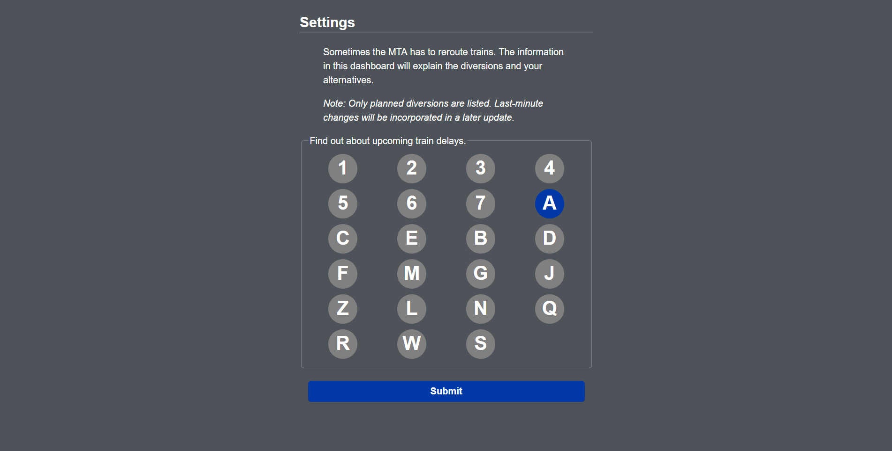

# MTA Dashboard

Performant mobile web site with instant transit info

VIEW LIVE: https://safe-fjord-88611.herokuapp.com/



## Motivation

MTA's Service Advisory Site has a clunky UI that doesn't map nicely to what subway riders want. In terms of selecting routes, users have two options. They can select either one route, or all routes. There is no option to get advisories for two or three routes. In terms of dates, users can only select one day at a time.

This dashboard app alleviates both of those problems. Users may select as many routes as they want, and they will receieve subway delays for the upcoming three date ranges (date ranges refer to either a Mon - Fri workday batch or a Sat - Sun weekend batch).

## Implementation

Underneath the hood, this Node application uses [`express`](https://github.com/expressjs/express) middleware to handle routing requests, and the [`nunjucks`](https://github.com/mozilla/nunjucks) templating engine for dynamic web page generation. 

The subway delays data is scraped ahead of time. Because the information is spread out across 78 different web pages (26 subway routes x 3 date ranges), requesting the data at load time would be way too slow.

Sample route: http://travel.mtanyct.info/serviceadvisory/routeStatusResult.aspx?tag=3&date={INSERT_DATE}&time=&method=getstatus4

*(Please replace {INSERT_DATE} with a M/D/YYYY formatted date. Something like 06/26/2017 would work.)*

To scrape the data, the Node application leverages [`htmlparser2`](https://github.com/fb55/htmlparser2), a low-level HTML, XML and RSS parsing library. [`htmlparser2`](https://github.com/fb55/htmlparser2) is the basis of the popular scraping library [`cheerio`](https://github.com/cheeriojs/cheerio).

Data scraping is invoked at the start of each day through the [Heroku Scheduler Add-on](https://devcenter.heroku.com/articles/scheduler) and the resulting information then gets stored into a [mLab MongoDB Add-on](https://elements.heroku.com/addons/mongolab) database.  This ensures that users have a fresh batch of information on Mondays when the new workday batch starts, and on Saturdays when the new weekend batch starts. 

## Testing

Tests are organized in a BDD-structure. For example:

```javascript
describe('cleanSubwayData', function() {

  it('should prune repeats in the advisories property', function() {
    const cleaned = cleanSubwayData(workBatches)
    cleaned.forEach(workBatch => {
      const advisories = workBatch.advisories
      const messages = [].concat(Object.keys(advisories))

      // Set automatically deletes duplicates
      messages.should.have.lengthOf(new Set(messages).size)
    })
  })
  
})
```

The repo uses `mocha` as its test runner and `chai` as its assertion library. A few tests also invoke `lodash` for its clean API of array transformations.

Most tests are unit tests and assert internal logic. As such, they run super fast and are automatically wrapped with [`nodemon`](https://github.com/remy/nodemon). ([`nodemon`](https://github.com/remy/nodemon) is a developer convenience that restarts a task whenever a file gets changed. In other words, the `npm test` command will run in watch mode and repeat every time the developer adds, deletes or modifies a line of code. This improves the feedback loop and helps catch bugs.)

A few tests rely on network requests to complete, and run super slow. These tests exist because of architectural design flaws and will be phased out in the future (see #40). They include `(slow)` in their titles, and are automatically ignored by the default `npm test` command. If the developer wishes to include these tests, they can run `npm run test:all` to invoke them in addition to the unit tests.

## Work in Progress

* Bus Stop Monitoring: Check when the next bus is coming. (This mostly needs UI work. See https://github.com/geoffreyyip/mta-dashboard/milestone/1)
* Last-Minute Subway Changes (This will require integrating the service advisory API to match the planned-delays data format.)
* 
